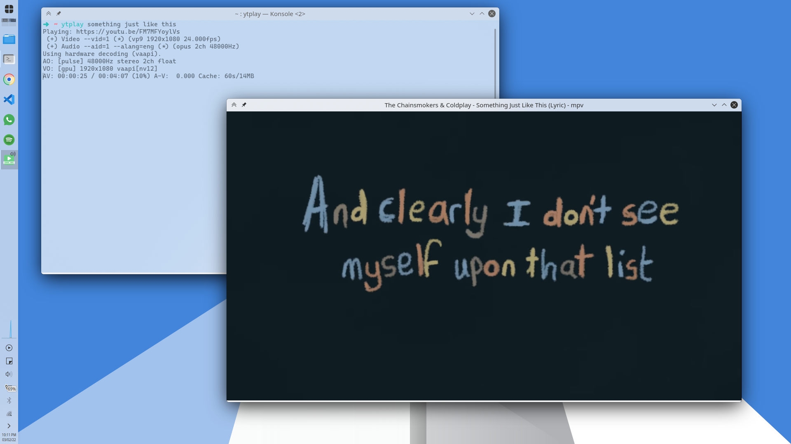
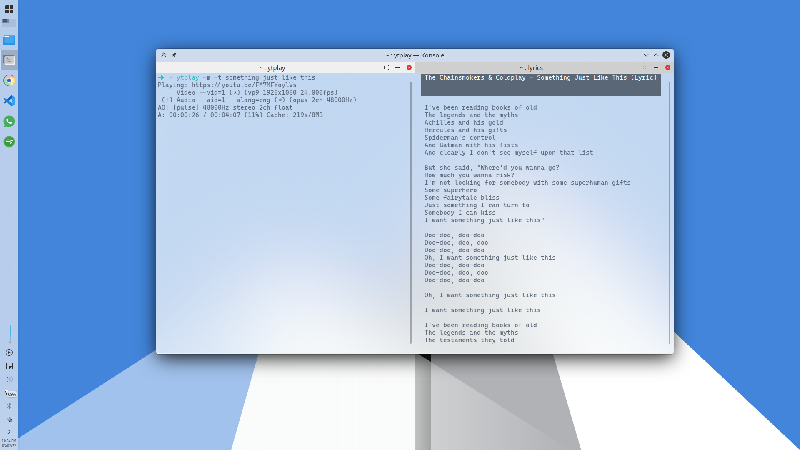
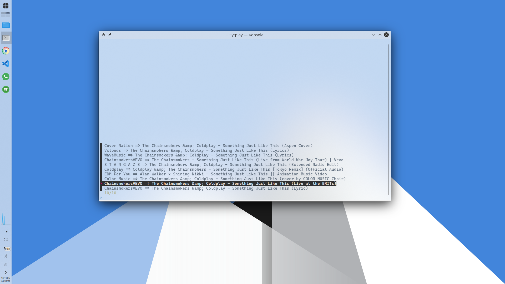

# ytplay

A simple bash script to play YouTube videos from terminal.

Supports:
- Music only playback
- List of search results to select from
- Play on infinite loop

## Screenshots

|With video|Without video|
|----|----|
|||

*Lyrics on the right shown using [lyrics-in-terminal](https://github.com/Jugran/lyrics-in-terminal).*

## Requirements

`mpv`, `youtube-dl`, `jq`, `curl`, `awk` and `fzf`.

## Usage

```
ytplay [OPTION] query

OPTIONS:
	-m, --music                Music only mode. No video playback.
	-t, --top                  Play the top search result. No options presented.
	-l, --loop                 Play the media on an infinite loop
	-r, --results COUNT        Specify the number of options to be presented
	-h, --help                 Show this help
```

## Install

Copy [ytplay](ytplay) to your `~/.local/bin` directory, like so:

```bash
curl https://raw.githubusercontent.com/nisiddharth/ytplay/main/ytplay > ~/.local/bin/ytplay && chmod +x ~/.local/bin/ytplay
```

Also, the script needs [YouTube Data API key](https://developers.google.com/youtube/v3/docs/search/list). You can either keep that in `~/.api_keys/YT_API_KEY` or edit the appropriate line in the script.

## Example

```bash
ytplay something just like this
```

Presents these 10 search results on `fzf` and plays the selected video on pressing enter:


